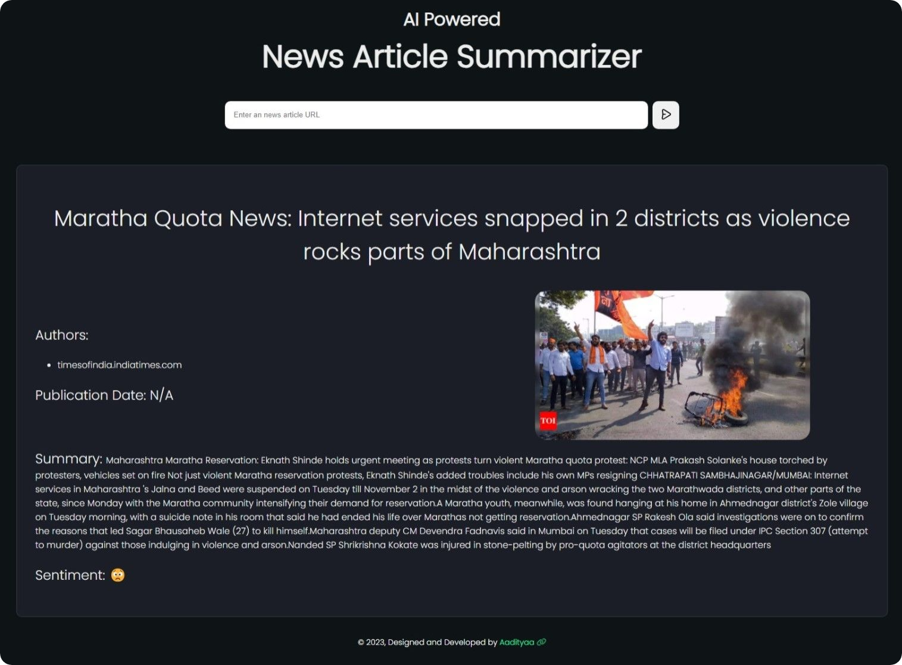

## About The Project



AI-News-Summariser is a tool designed to automatically generate concise summaries of news articles using artificial intelligence. Stay informed without spending too much time reading lengthy articles.

### Features 

- 🌐 Scrape and summarize live news articles
- ✨ Automatic language detection and summarization
- 🌙 Dark mode and 🌞 Light mode support
- 📷 Clean UI with branding and responsive design
- 📦 Simple and lightweight Flask application

## 🛠️ Technologies Used

- Python
- Flask – Web framework
- newspaper3k – News content extraction
- transformers (HuggingFace) – Summarization model
- HTML/CSS – Front-end with dark/light themes
  
## Getting Started
AI-News-Summariser can be installed and used on various platforms. Follow the steps below to get started.

## 🖥️ How to Run the Project

### ✅ Prerequisites

- Python 3.7 or above
- `pip` (Python package installer)

### 📦 Installation Steps

1. **Clone the Repository**
   ```bash
   git clone https://github.com/your-username/AI-News-Summariser.git
   cd AI-News-Summariser
   
2. **Install Dependencies**
pip install -r requirements.txt

4. **Run the App**
python app.py

6. **Open a browser and visit:**
http://127.0.0.1:5000/

## Future features and improvements

- [ ] Customize summarization preferences.
- [ ] Tackling corner cases where some news articles won't be parsed properly.
- [ ] Customizable summarization algorithms.
- [ ] User accounts and preferences.
- [ ] Mobile app version.
- [ ] Improvements in summarization accuracy.

See the [open issues](https://github.com/oxlac/AI-News-Summariser/issues) for a full list of proposed features and known issues.

<p align="right">(<a href="#readme-top">back to top</a>)</p>

## Contributing
Contributions are what makes the open-source community such an amazing place to learn, inspire, and create. Any contributions you make are **greatly appreciated**.

If you have a suggestion that would make this better, please fork the repo and create a pull request. You can also simply open an issue with the tag "enhancement".
Don't forget to give the project a star! Thanks again!

1. Fork the Project
2. Create your Feature Branch (`git checkout -b feature/AmazingFeature`)
3. Commit your Changes (`git commit -m 'Add some AmazingFeature'`)
4. Ensure that your code passes the ruff linter. If it does not pass view the errors and fix them.
4. Push to the Branch (`git push origin feature/AmazingFeature`)
5. Open a Pull Request

<p align="right">(<a href="#readme-top">back to top</a>)</p>

## License
Distributed under the MIT License. See LICENSE.txt for more information.

<p align="right">(<a href="#readme-top">back to top</a>)</p>

## Contact
Your Name - [@Oxlac_](https://twitter.com/Oxlac_) - contact@oxlac.com

Discord Server - [https://discord.gg/2YdnSGHdET](https://discord.gg/2YdnSGHdET)

Project Link: [https://github.com/Oxlac/AI-News-Summariser](https://github.com/oxlac/mr.dm)

Developer: [Aadityaa Nagarajan](https://aadinagarajan.com)
