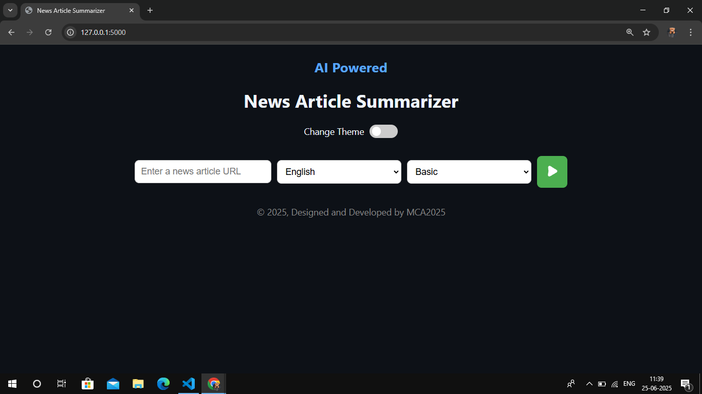
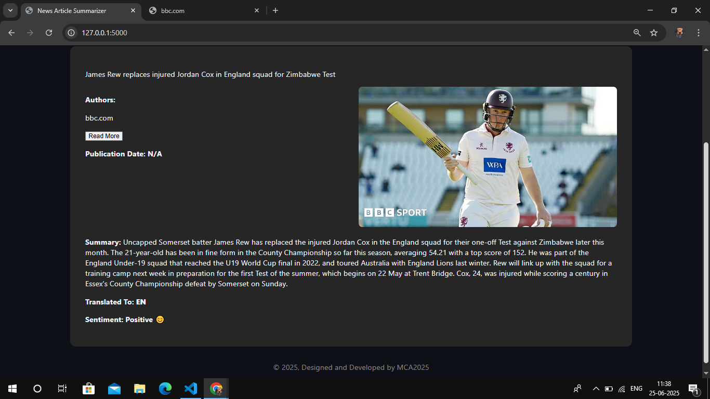

## About The Project


An intelligent web application that extracts, analyzes, and summarizes news articles using AI.
Built with Flask, Python, and modern UI components, this tool allows users to quickly generate clear and concise summaries from any news URL.


<br>


### 📌 How It Works

- User enters a news article URL.
- The backend scrapes the article content.
- AI/NLP model processes the text.
- Summary is generated (Basic or Detailed).
- Output is displayed on the webpage in selected language.

### Features 

- 🌐 Scrape and summarize live news articles
- ✨ Automatic language detection and summarization
- 🌙 Dark mode and 🌞 Light mode support
- 📷 Clean UI with branding and responsive design
- 📦 Simple and lightweight Flask application

## 🛠️ Technologies Used

- Python
- Flask – Web framework
- newspaper3k – News content extraction
- transformers (HuggingFace) – Summarization model
- HTML/CSS – Front-end with dark/light themes
  
## Getting Started
AI-News-Summariser can be installed and used on various platforms. Follow the steps below to get started.

## 🖥️ How to Run the Project

### ✅ Prerequisites

- Python 3.7 or above
- `pip` (Python package installer)

### 📦 Installation Steps

1. **Clone the Repository**
   ```bash
   git clone https://github.com/your-username/AI-News-Summariser.git
   cd AI-News-Summariser
   
2. **Install Dependencies**
pip install -r requirements.txt

4. **Run the App**
python app.py

6. **Open a browser and visit:**
http://127.0.0.1:5000/

## Future features and improvements

- [ ] Customize summarization preferences.
- [ ] Tackling corner cases where some news articles won't be parsed properly.
- [ ] Customizable summarization algorithms.
- [ ] User accounts and preferences.
- [ ] Improvements in summarization accuracy.

